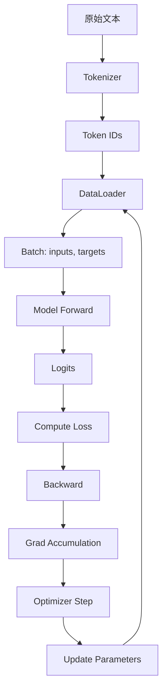

### nonochat - LLM Base 训练完整解析

[nonochat](https://github.com/karpathy/nanochat)

> 本文档详细解析 `base_train.py`，从零开始讲解如何训练一个语言模型。  
> 适合 LLM 领域的初学者，包含大量可视化和维度分析。

---

## 目录

1. [什么是 Base 训练](#1-什么是-base-训练)
2. [数据流转全过程](#2-数据流转全过程)
3. [模型架构详解](#3-模型架构详解)
4. [训练循环深度剖析](#4-训练循环深度剖析)
5. [关键概念速查](#5-关键概念速查)

---

## 1. 什么是 Base 训练

### 1.1 训练流程概览

```
原始文本 → Tokenizer → Token IDs → Model → Logits → Loss → 梯度 → 更新参数
```

**Base 训练**是 LLM 训练的第一阶段，也称为**预训练 (Pre-training)**。

### 1.2 训练目标

**核心任务：给定前面的词，预测下一个词**

例如：
```
输入：  "The capital of France is"
目标：  预测下一个词 "Paris"
```

数学表达：
$$
\mathcal{L} = -\log P(w_t | w_1, w_2, ..., w_{t-1})
$$

这叫做**自回归语言建模 (Autoregressive Language Modeling)**。

### 1.3 为什么叫 "Base"

因为这个阶段训练出来的是**基础模型 (Base Model)**：
- ✅ 有通用语言理解能力
- ✅ 能够完成句子
- ❌ 不会遵循指令
- ❌ 不会对话

后续需要通过 SFT 和 RL 来让模型学会对话和遵循指令。

---

## 2. 数据流转全过程

### 2.1 从文本到张量（图解）

让我们通过一个具体例子理解整个数据流：

```
原始文本：
"Hello world! This is a test."

↓ [Tokenizer 分词]

Token IDs：
[15496, 995, 0, 831, 374, 264, 1296, 13]

↓ [组织成批次]

inputs:  [15496, 995,   0, 831, 374, 264, 1296]  # 前 7 个
targets: [  995,   0, 831, 374, 264,1296,   13]  # 后 7 个（向右移一位）

↓ [送入模型]

logits: shape (batch_size, seq_len, vocab_size)

↓ [计算损失]

loss: 一个标量（越小越好）
```

### 2.2 数据加载详解

#### 代码位置：`nanochat/dataloader.py`

```python
# 数据加载器的核心功能
def tokenizing_distributed_data_loader(B, T, split, device="cuda"):
    """
    参数说明：
    - B: batch size (批次大小)，例如 32
    - T: sequence length (序列长度)，例如 2048
    - split: "train" 或 "val"
    - device: "cuda" 或 "cpu"
    
    返回：
    - inputs: shape (B, T) 的整数张量
    - targets: shape (B, T) 的整数张量
    """
```

#### 数据存储格式

```
tokenized_data/
├── fineweb_edu_00000.parquet  # Parquet 格式存储
├── fineweb_edu_00001.parquet
├── ...
└── fineweb_edu_00099.parquet
```

每个 parquet 文件包含：
- `text` 列：原始文本字符串
- 大约 1024 行一组（称为 row group）

#### 数据流转步骤

**步骤 1：读取 Parquet 文件**

```python
pf = pq.ParquetFile(filepath)
rg = pf.read_row_group(rg_idx)  # 读取一组（1024 条文本）
batch = rg.column('text').to_pylist()  # 转为 Python 列表
```

**步骤 2：Tokenization (分词)**

```python
# 输入：["Hello world", "This is a test", ...]
# 输出：[[15496, 995], [831, 374, 264, 1296], ...]

token_lists = tokenizer.encode(doc_batch, prepend=bos_token)
# bos_token = <|bos|> (Beginning of Sequence)
```

**步骤 3：累积到缓冲区**

```python
token_buffer = deque()  # 双端队列

for tokens in token_lists:
    token_buffer.extend(tokens)  # 把所有 token 连起来
    
# 例如：token_buffer = [15496, 995, 831, 374, 264, 1296, ...]
#                        (成千上万个 token 连在一起)
```

**步骤 4：切分成批次**

```python
needed_tokens = B * T + 1  # 例如：32 * 2048 + 1 = 65537

# 取出 65537 个 token
tokens = [token_buffer.popleft() for _ in range(needed_tokens)]

# 分割成 inputs 和 targets
inputs_cpu = tokens[:-1]   # 前 65536 个
targets_cpu = tokens[1:]   # 后 65536 个（向右移一位）

# 重塑为 2D 张量
inputs = inputs_cpu.view(B, T)   # (32, 2048)
targets = targets_cpu.view(B, T) # (32, 2048)
```

### 2.3 批次的形状（Shape）

让我们用 `B=4, T=8` 作为例子理解：

```python
# 假设 token_buffer 中有这些 token IDs：
# [101, 202, 303, 404, 505, 606, 707, 808, 909, 1010, ...]

inputs = [
    [101, 202, 303, 404, 505, 606, 707, 808],  # 样本 1
    [909, 1010, 1111, 1212, 1313, 1414, 1515, 1616],  # 样本 2
    [1717, 1818, 1919, 2020, 2121, 2222, 2323, 2424],  # 样本 3
    [2525, 2626, 2727, 2828, 2929, 3030, 3131, 3232],  # 样本 4
]  # shape: (4, 8)

targets = [
    [202, 303, 404, 505, 606, 707, 808, 909],  # 样本 1 的目标
    [1010, 1111, 1212, 1313, 1414, 1515, 1616, 1717],  # 样本 2 的目标
    [1818, 1919, 2020, 2121, 2222, 2323, 2424, 2525],  # 样本 3 的目标
    [2626, 2727, 2828, 2929, 3030, 3131, 3232, 3333],  # 样本 4 的目标
]  # shape: (4, 8)
```

**关键观察：**
- inputs 的每个位置都要预测 targets 的对应位置
- targets 就是 inputs 向右移动一位
- 这就是**因果语言建模 (Causal Language Modeling)**

---

## 3. 模型架构详解

### 3.1 GPT 模型结构

本项目使用的是 **GPT-style Transformer**，结构如下：

```
输入 token IDs: (B, T)
    ↓
[Token Embedding]  ← 把 token ID 转为向量
    ↓
    x: (B, T, D)  # D = n_embd (例如 768)
    ↓
[RMSNorm]
    ↓
[Transformer Block 1]
    ↓
[Transformer Block 2]
    ↓
    ...
    ↓
[Transformer Block N]  # N = n_layer (例如 12)
    ↓
[RMSNorm]
    ↓
[LM Head]  ← 预测下一个 token
    ↓
logits: (B, T, vocab_size)  # vocab_size 例如 32000
```

### 3.2 模型配置（以 depth=12 为例）

```python
@dataclass
class GPTConfig:
    sequence_len: int = 2048      # 最大上下文长度
    vocab_size: int = 32000       # 词表大小
    n_layer: int = 12             # Transformer 层数
    n_head: int = 6               # 注意力头数量
    n_kv_head: int = 6            # KV 头数量（GQA）
    n_embd: int = 768             # 隐藏层维度
```

**关键推导：**

```python
depth = 12  # 用户指定的深度

# 自动推导其他参数
n_layer = depth                    # 12 层
n_embd = depth * 64                # 12 * 64 = 768
n_head = max(1, (n_embd + 127) // 128)  # ceil(768 / 128) = 6
head_dim = n_embd // n_head        # 768 / 6 = 128

# 参数量计算（简化版）
# Embedding: vocab_size * n_embd
# Transformer: n_layer * (4 * n_embd^2)  # 近似
# LM Head: vocab_size * n_embd
```

**模型大小示例：**

| depth | n_embd | n_layer | 参数量 |
|-------|--------|---------|--------|
| 6     | 384    | 6       | ~50M   |
| 12    | 768    | 12      | ~200M  |
| 20    | 1280   | 20      | ~600M  |
| 32    | 2048   | 32      | ~1.6B  |

### 3.3 Transformer Block 详解

每个 Transformer Block 包含两部分：

```python
class Block(nn.Module):
    def forward(self, x, cos_sin, kv_cache):
        # 1. 自注意力（Self-Attention）
        x = x + self.attn(norm(x), cos_sin, kv_cache)
        
        # 2. 前馈网络（Feed-Forward）
        x = x + self.mlp(norm(x))
        
        return x
```

#### 3.3.1 自注意力机制 (Self-Attention)

**作用：让每个 token 能"看到"前面的所有 token**

```python
class CausalSelfAttention(nn.Module):
    def forward(self, x, cos_sin, kv_cache):
        B, T, C = x.size()  # 批次, 序列长度, 通道数
        
        # 1. 计算 Q, K, V
        q = self.c_q(x)  # (B, T, C) → (B, T, n_head * head_dim)
        k = self.c_k(x)  # (B, T, C) → (B, T, n_kv_head * head_dim)
        v = self.c_v(x)  # (B, T, C) → (B, T, n_kv_head * head_dim)
        
        # 2. 重塑为多头格式
        q = q.view(B, T, self.n_head, self.head_dim)
        k = k.view(B, T, self.n_kv_head, self.head_dim)
        v = v.view(B, T, self.n_kv_head, self.head_dim)
        
        # 3. 应用旋转位置编码（RoPE）
        q = apply_rotary_emb(q, cos, sin)
        k = apply_rotary_emb(k, cos, sin)
        
        # 4. QK 归一化
        q, k = norm(q), norm(k)
        
        # 5. 转置：(B, T, H, D) → (B, H, T, D)
        q = q.transpose(1, 2)
        k = k.transpose(1, 2)
        v = v.transpose(1, 2)
        
        # 6. 计算注意力（因果掩码）
        y = F.scaled_dot_product_attention(q, k, v, is_causal=True)
        # y: (B, H, T, D)
        
        # 7. 转回并投影
        y = y.transpose(1, 2).contiguous().view(B, T, C)
        y = self.c_proj(y)
        
        return y
```

**注意力计算过程（图解）：**

假设 `T=4, head_dim=2`：

```
Query (q):        Key (k):          Value (v):
[[1, 2],          [[5, 6],          [[9, 10],
 [3, 4],           [7, 8],           [11, 12],
 [5, 6],           [9, 10],          [13, 14],
 [7, 8]]           [11, 12]]         [15, 16]]

↓ [计算 Q @ K^T / sqrt(d)]

Attention Scores:
[[x,  -,  -,  -],    ← 第1个token只能看第1个
 [x,  x,  -,  -],    ← 第2个token能看前2个
 [x,  x,  x,  -],    ← 第3个token能看前3个
 [x,  x,  x,  x]]    ← 第4个token能看所有
 
 (- 表示被 mask 掉的位置，因果掩码)

↓ [Softmax]

Attention Weights: (每行和为1)

↓ [加权求和 V]

Output: (B, T, head_dim)
```

**关键：因果掩码 (Causal Mask)**

```python
# 因果掩码确保位置 i 只能看到 <= i 的位置
# is_causal=True 等价于：
mask = torch.tril(torch.ones(T, T))
# [[1, 0, 0, 0],
#  [1, 1, 0, 0],
#  [1, 1, 1, 0],
#  [1, 1, 1, 1]]
```

#### 3.3.2 前馈网络 (MLP)

**作用：对每个 token 的表示进行非线性变换**

```python
class MLP(nn.Module):
    def forward(self, x):
        # x: (B, T, C)
        
        x = self.c_fc(x)     # (B, T, C) → (B, T, 4*C)
        x = F.relu(x).square()  # ReLU^2 激活
        x = self.c_proj(x)   # (B, T, 4*C) → (B, T, C)
        
        return x
```

**为什么用 4*C？**
- 标准 Transformer 使用 4 倍扩展
- 更大的中间维度 = 更强的表达能力
- 示例：768 → 3072 → 768

**ReLU^2 vs 传统激活函数：**

```python
# 传统 GELU
x = gelu(x)

# 本项目：ReLU^2
x = relu(x) ** 2

# ReLU^2 的优点：
# - 更简单，计算更快
# - 梯度行为更好
# - 性能相近或更好
```

### 3.4 前向传播完整流程

#### 输入输出维度变化

让我们跟踪一个批次的维度变化（`B=32, T=2048, vocab_size=32000, n_embd=768`）：

```python
# 输入
inputs: (32, 2048)  # 整数 token IDs

# 1. Token Embedding
x = self.transformer.wte(inputs)
# (32, 2048) → (32, 2048, 768)

# 2. RMSNorm
x = norm(x)
# (32, 2048, 768) → (32, 2048, 768)

# 3. Transformer Blocks (重复 12 次)
for block in self.transformer.h:
    x = block(x, cos_sin, kv_cache)
# (32, 2048, 768) → (32, 2048, 768)

# 4. 最终 RMSNorm
x = norm(x)
# (32, 2048, 768) → (32, 2048, 768)

# 5. LM Head (输出层)
logits = self.lm_head(x)
# (32, 2048, 768) @ (768, 32000) → (32, 2048, 32000)

# 6. Softcap（平滑限制）
logits = 15 * tanh(logits / 15)
# (32, 2048, 32000) → (32, 2048, 32000)
```

**最终 logits 的含义：**

```python
logits[b, t, v] = 第 b 个样本，第 t 个位置，预测 token v 的得分

# 例如：
logits[0, 10, 5234] = 8.5  # 样本0，位置10，预测 token 5234 的得分
```

### 3.5 损失计算（核心）

#### 从 Logits 到 Loss

```python
# logits: (B, T, vocab_size) = (32, 2048, 32000)
# targets: (B, T) = (32, 2048)

# 1. Flatten 成 2D
logits_2d = logits.view(-1, vocab_size)  # (65536, 32000)
targets_1d = targets.view(-1)             # (65536,)

# 2. 交叉熵损失
loss = F.cross_entropy(logits_2d, targets_1d)

# 3. loss 是一个标量
# loss = -mean(log P(targets[i] | inputs[i]))
```

#### 交叉熵详解（单个样本）

假设在某个位置：
```python
logits = [2.0, 1.0, 3.0, 0.5, ...]  # 32000 个数字
target = 2  # 正确答案是第 2 个 token

# 步骤 1: Softmax 转为概率
probs = softmax(logits)
# [0.1, 0.05, 0.3, 0.02, ...]  # 和为 1

# 步骤 2: 取目标位置的概率
p = probs[target]  # probs[2] = 0.3

# 步骤 3: 负对数
loss_i = -log(p) = -log(0.3) ≈ 1.2

# 越接近 1，loss 越小
# 越远离 1，loss 越大
```

**批次损失：**

```python
# 对所有 B*T = 65536 个位置的损失取平均
loss = mean([loss_0, loss_1, ..., loss_65535])
```

---

## 4. 训练循环深度剖析

### 4.1 训练循环概览

```python
for step in range(num_iterations):
    # 1. 前向传播（计算损失）
    # 2. 反向传播（计算梯度）
    # 3. 更新参数
    # 4. 评估
```

### 4.2 梯度累积（Gradient Accumulation）

**为什么需要梯度累积？**

GPU 显存有限，无法一次处理太大的批次。

**解决方案：**
```python
# 目标：total_batch_size = 524288 tokens
# 实际：device_batch_size = 32, seq_len = 2048
# 单步：32 * 2048 = 65536 tokens
# 需要：524288 / 65536 = 8 步累积

grad_accum_steps = 8

for micro_step in range(grad_accum_steps):
    # 每次前向传播
    loss = model(x, y)
    
    # 归一化损失（因为要累加 8 次）
    loss = loss / grad_accum_steps
    
    # 反向传播（梯度累加）
    loss.backward()
    
    # 获取下一批数据
    x, y, state = next(train_loader)

# 8 次累积后，一次性更新参数
optimizer.step()
model.zero_grad()
```

**图解：**

```
Micro-batch 1: loss=0.5 → backward → grad += ∂L1
Micro-batch 2: loss=0.6 → backward → grad += ∂L2
Micro-batch 3: loss=0.4 → backward → grad += ∂L3
...
Micro-batch 8: loss=0.5 → backward → grad += ∂L8

→ optimizer.step()  # 用累积的梯度更新
→ zero_grad()       # 清零，准备下一轮
```

### 4.3 优化器配置

本项目使用**混合优化器**：

```python
# AdamW：用于 Embedding 和 LM Head
adamw_optimizer = DistAdamW([
    {"params": wte.parameters(), "lr": embedding_lr},
    {"params": lm_head.parameters(), "lr": unembedding_lr},
])

# Muon：用于 Transformer 的权重矩阵
muon_optimizer = Muon([
    {"params": transformer_blocks.parameters(), "lr": matrix_lr},
])
```

**学习率配置（depth=12）：**

```python
embedding_lr = 0.2      # Embedding 层（最高）
unembedding_lr = 0.004  # 输出层（最低）
matrix_lr = 0.02        # 中间层
```

**为什么不同学习率？**
- Embedding 更新频繁，需要快速适应
- LM Head 更敏感，需要小心更新
- 中间层介于两者之间

### 4.4 学习率调度

```python
def get_lr_multiplier(it):
    warmup_iters = warmup_ratio * num_iterations    # 例如 0% = 0
    warmdown_iters = warmdown_ratio * num_iterations  # 例如 20%
    
    if it < warmup_iters:
        # Warmup 阶段：线性增长
        return (it + 1) / warmup_iters
    elif it <= num_iterations - warmdown_iters:
        # 主训练阶段：保持 100%
        return 1.0
    else:
        # Warmdown 阶段：线性衰减
        progress = (num_iterations - it) / warmdown_iters
        return progress * 1.0 + (1 - progress) * final_lr_frac
```

**学习率曲线（num_iterations=1000, warmdown_ratio=0.2）：**

```
LR Multiplier
    1.0 |         ═════════════════════════╲
        |                                   ╲
        |                                    ╲
    0.5 |                                     ╲
        |                                      ╲
    0.0 |                                       ══
        +----------------------------------------→
        0     200    400    600    800    1000   step
              ←─── 主训练 ───→  ←─ warmdown ─→
```

**为什么要 Warmdown？**
- 训练后期减小学习率
- 有助于模型收敛到更好的局部最优
- 避免参数在最后阶段震荡

### 4.5 单步训练的详细流程

```python
# ============= 第 1 步：前向传播 =============
for micro_step in range(grad_accum_steps):
    with autocast_ctx:  # 使用 bfloat16 加速
        # inputs: (32, 2048)
        # targets: (32, 2048)
        
        loss = model(inputs, targets)
        # loss: 标量
        
    # 归一化
    loss = loss / grad_accum_steps
    
    # ============= 第 2 步：反向传播 =============
    loss.backward()
    # 计算所有参数的梯度
    # param.grad += ∂loss/∂param
    
    # 获取下一批数据（异步）
    inputs, targets, state = next(train_loader)

# ============= 第 3 步：梯度裁剪 =============
if grad_clip > 0:
    grad_norm = torch.nn.utils.clip_grad_norm_(
        model.parameters(), 
        grad_clip
    )
    # 防止梯度爆炸

# ============= 第 4 步：更新学习率 =============
lrm = get_lr_multiplier(step)
for opt in optimizers:
    for group in opt.param_groups:
        group["lr"] = group["initial_lr"] * lrm

# ============= 第 5 步：更新参数 =============
for opt in optimizers:
    opt.step()
    # θ_new = θ_old - lr * grad

# ============= 第 6 步：清零梯度 =============
model.zero_grad(set_to_none=True)
# 准备下一轮
```

### 4.6 评估指标

#### BPB (Bits Per Byte)

**定义：** 平均每个字节需要多少比特来编码

```python
def evaluate_bpb(model, val_loader, eval_steps, token_bytes):
    total_loss = 0
    total_bytes = 0
    
    for _ in range(eval_steps):
        inputs, targets = next(val_loader)
        loss = model(inputs, targets)  # 交叉熵损失
        
        # 计算这批数据的字节数
        num_bytes = token_bytes[targets].sum()
        
        total_loss += loss * num_bytes
        total_bytes += num_bytes
    
    avg_loss = total_loss / total_bytes
    bpb = avg_loss / math.log(2)  # 转换为比特
    return bpb
```

**BPB 的意义：**
- 越小越好
- 理想情况：接近数据的熵
- 典型值：0.6 - 1.2 BPB

#### CORE Metric

评估模型在下游任务的表现：

```python
# 多个任务的综合评分
tasks = ["ARC-Easy", "ARC-Challenge", "HellaSwag", ...]
scores = [evaluate(model, task) for task in tasks]
core_metric = mean(scores)
```

### 4.7 训练监控

#### 关键日志

```python
# 训练日志示例
step 00250/10000 (2.50%) | loss: 1.234567 | grad norm: 0.8234 | 
lrm: 1.00 | dt: 245.32ms | tok/sec: 2,137,856 | mfu: 45.67 | 
total time: 10.25m
```

**各项指标含义：**

| 指标 | 含义 | 理想值 |
|-----|------|--------|
| loss | 训练损失 | 越小越好 |
| grad norm | 梯度范数 | <1.0 稳定 |
| lrm | 学习率乘数 | 按计划变化 |
| dt | 单步耗时 | 越短越好 |
| tok/sec | 吞吐量 | 越高越好 |
| mfu | 模型 FLOPs 利用率 | >40% 良好 |

#### Wandb 记录

```python
wandb.log({
    "step": step,
    "train/loss": loss,
    "train/lrm": lrm,
    "val/bpb": val_bpb,
    "core_metric": core_metric,
    "total_training_flops": flops_so_far,
})
```

---

## 5. 关键概念速查

### 5.1 数据相关

| 概念 | 解释 | 例子 |
|-----|------|------|
| Token | 文本的最小单位 | "Hello" → [15496] |
| Tokenizer | 文本转 token ID | "Hi!" → [15496, 0] |
| Batch Size | 一次处理多少样本 | 32 |
| Sequence Length | 每个样本的长度 | 2048 |
| Autoregressive | 从左到右预测 | 给定前 n 个词预测第 n+1 个 |

### 5.2 模型相关

| 概念 | 解释 | 典型值 |
|-----|------|--------|
| n_layer | Transformer 层数 | 12, 24, 32 |
| n_embd | 隐藏层维度 | 768, 1024, 2048 |
| n_head | 注意力头数 | 6, 12, 16 |
| vocab_size | 词表大小 | 32000, 50000 |
| Parameters | 模型参数量 | 200M, 1.5B, 7B |

### 5.3 训练相关

| 概念 | 解释 | 典型值 |
|-----|------|--------|
| Learning Rate | 学习率 | 0.004 - 0.2 |
| Gradient Accumulation | 梯度累积步数 | 8, 16 |
| Warmup | 学习率预热 | 0% - 10% |
| Warmdown | 学习率衰减 | 10% - 30% |
| Grad Clip | 梯度裁剪 | 1.0 |

### 5.4 评估相关

| 概念 | 解释 | 含义 |
|-----|------|------|
| BPB | Bits Per Byte | 压缩质量 |
| Perplexity | 困惑度 | exp(loss) |
| Loss | 交叉熵损失 | 越小越好 |
| Accuracy | 准确率 | 任务相关 |

### 5.5 维度速查表

**常见张量形状：**

```python
# B = batch_size (例如 32)
# T = seq_len (例如 2048)
# C = n_embd (例如 768)
# V = vocab_size (例如 32000)
# H = n_head (例如 6)
# D = head_dim (例如 128)

inputs:  (B, T)           # Token IDs
targets: (B, T)           # 目标 IDs
x:       (B, T, C)        # 隐藏状态
logits:  (B, T, V)        # 输出 logits
q, k, v: (B, H, T, D)     # 注意力的 Q, K, V
loss:    ()               # 标量
```

### 5.6 训练流程总结



### 5.7 从 Base 到应用

```
Base Training (本文档)
    ↓
    学会：通用语言理解，语法，常识
    ↓
Mid Training (可选)
    ↓
    学会：特定领域知识，工具使用
    ↓
SFT (Supervised Fine-Tuning)
    ↓
    学会：指令跟随，对话格式
    ↓
RL (Reinforcement Learning)
    ↓
    学会：复杂推理，人类偏好对齐
    ↓
最终模型：可对话的 AI 助手
```

---

## 附录

### A. 完整训练命令

```bash
# 单 GPU 训练（小模型）
python -m scripts.base_train \
    --depth=12 \
    --device_batch_size=32 \
    --num_iterations=10000

# 8 GPU 分布式训练
torchrun --standalone --nproc_per_node=8 \
    -m scripts.base_train \
    --depth=20 \
    --device_batch_size=32 \
    --total_batch_size=524288 \
    --num_iterations=50000
```

### B. 常见问题

**Q1: 为什么 loss 不下降？**
- 检查学习率是否太小/太大
- 检查数据是否正确加载
- 检查梯度是否为 NaN

**Q2: 为什么 OOM（显存不足）？**
- 减小 `device_batch_size`
- 减小 `max_seq_len`
- 使用梯度检查点

**Q3: 训练需要多久？**
- 取决于模型大小和数据量
- 200M 模型：8x A100，约 1-2 天
- 1B 模型：8x A100，约 1 周

### C. 数学公式汇总

**自回归语言模型目标：**
$$
\mathcal{L} = -\frac{1}{N}\sum_{i=1}^{N} \log P(w_i | w_1, ..., w_{i-1})
$$

**交叉熵损失：**
$$
\mathcal{L}_{CE} = -\sum_{c=1}^{C} y_c \log(\hat{y}_c)
$$

**注意力计算：**
$$
\text{Attention}(Q, K, V) = \text{softmax}\left(\frac{QK^T}{\sqrt{d_k}}\right)V
$$

**RMSNorm：**
$$
\text{RMSNorm}(x) = \frac{x}{\sqrt{\frac{1}{d}\sum_{i=1}^{d}x_i^2}}
$$

---

## 总结

本文档从零开始详细解析了 Base 训练的完整流程：

1. **数据流转**：文本 → Tokens → 批次 → 模型
2. **模型架构**：Embedding → Transformer → LM Head
3. **训练循环**：前向 → 反向 → 更新参数
4. **关键技术**：梯度累积、混合优化器、学习率调度

**下一步学习：**
- Mid Training：在特定领域继续训练
- SFT：教模型遵循指令
- RL：通过强化学习优化模型行为

**核心思想：**
语言模型本质上是一个概率模型，通过不断预测下一个词来学习语言的规律。Base 训练阶段建立了这个基础能力。

---

*本文档基于 nanochat 项目分析生成*  
*适合 LLM 初学者深入理解训练流程*  
*创建时间: 2025年12月21日*
